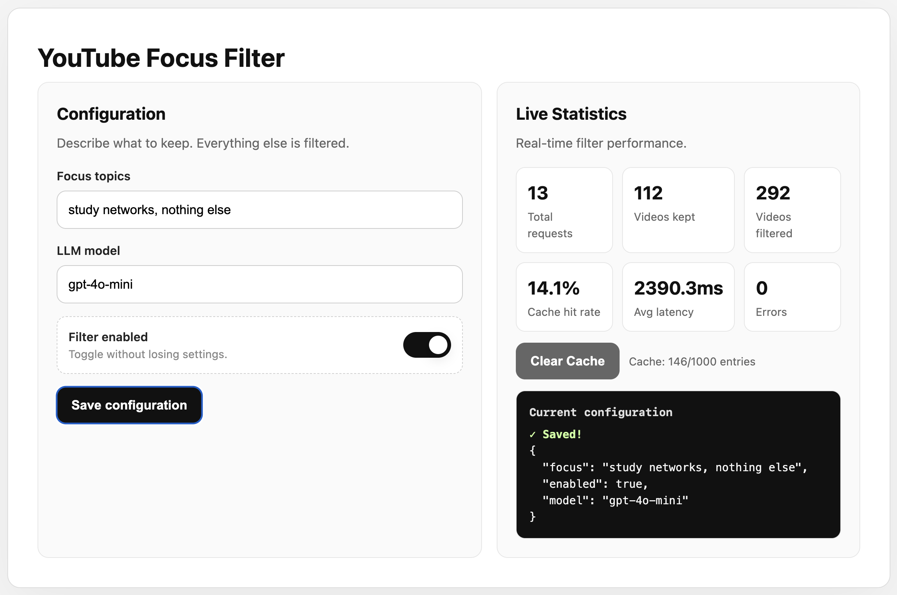
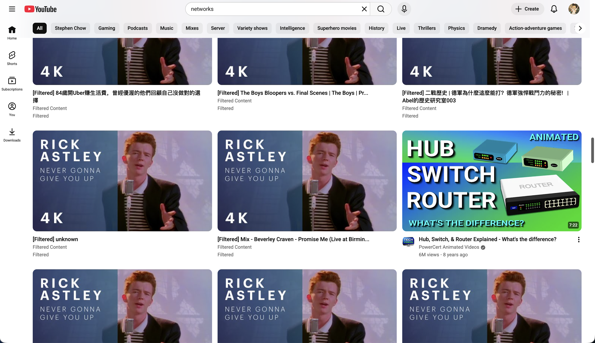

# LLM-enabled YouTube Focus Filter

A man-in-the-middle proxy that rewrites YouTube recommendation payloads with an LLM so you only see videos that match your focus goal.

## How it works
- System PAC routes `*.youtube.com` to the local proxy on `127.0.0.1:9400`.
- A C MITM proxy handles TLS and forwards responses to the Python filter service on port `5000`.
- The Python service calls an OpenAI-compatible model (e.g., `gpt-4o-mini`) to score candidate videos against your focus text, drops the rest, and serves the modified response back to the browser.
- A small web UI + HTTP API on `http://localhost:5001` lets you toggle filtering, edit the focus text, view stats, and clear cache. If no LLM key is provided, traffic simply passes through unfiltered.

## Prerequisites
- Docker + Docker Compose
- Ports `9400` (proxy) and `5001` (UI/API) available
- OpenAI API key set as `OPENAI_API_KEY` (required to actually filter)
- Trust the bundled CA `c_client/proxy_ca.crt` in your OS/browser so HTTPS to YouTube succeeds

## Quick start
1) Create `server/.env` with your key and optional defaults:
   ```bash
   echo 'OPENAI_API_KEY=sk-...' > server/.env
   echo 'FOCUS=study networks, nothing else' >> server/.env   # optional
   echo 'LLM_MODEL=gpt-4o-mini' >> server/.env                 # optional
   ```
2) Start the stack:
   ```bash
   chmod +x up.sh
   ./up.sh
   ```
3) Set a PAC file so `*.youtube.com` goes through the proxy. You can use the ready-made PAC:
   ```
   https://gist.githubusercontent.com/chihumyum/d3a66649d59bde00e7587721424e438d/raw/549d1450bf19c058d0eb23de29dcef50b29cdc48/gistfile1.txt
   ```
   Or save your own PAC with:
   ```js
   function FindProxyForURL(url, host) {
       host = host.toLowerCase();
       if (shExpMatch(host, "*youtube.com")) {
           return "PROXY 127.0.0.1:9400";  // replace with your host IP if remote
       }
       return "DIRECT";
   }
   ```
   PAC setup guides: [macOS](https://support.apple.com/zh-sg/guide/mac-help/mchlp2591/mac) / [Windows](https://medium.com/@gireeshagmt/tackling-proxy-how-to-use-proxy-auto-config-pac-on-windows-11-e9a6fa585918).
4) Open `http://localhost:5001` to turn filtering on, edit your focus text, inspect stats, or clear cache.
5) Browse YouTube normally; when filtering is enabled, off-topic videos are removed client-side.

## Screenshots
- Web UI to toggle filtering and set focus text  
  
- Example filtered YouTube feed  
  

## Configuration
- `OPENAI_API_KEY`: required for filtering; without it, responses pass through.
- `FOCUS`: default focus text at startup.
- `LLM_MODEL`: model name sent to the OpenAI API.
- `LLM_TIMEOUT`, `CACHE_SIZE`, `CACHE_TTL`, `SERVER_HOST`, `TCP_PORT`, `HTTP_PORT`: advanced tuning for the Python service.
- `PY_SERVER_HOST`, `PY_SERVER_PORT`: how the C proxy reaches the Python service (set in `docker-compose.yml`).
- API endpoints: `/config`, `/stats`, `/health`, `/cache`, and `/cache/clear` on `http://localhost:5001`.

## Maintenance
- Stop everything: `./down.sh`
- Tail logs: `docker compose logs -f server mitm_proxy`
- Health check: `curl http://localhost:5001/health`

## Troubleshooting
- Browser shows certificate/HTTPS errors: ensure `c_client/proxy_ca.crt` is installed as a trusted root and the PAC points to the right host/port.
- No filtering happening: confirm `OPENAI_API_KEY` is present, the UI toggle is on, and `/health` returns `status: "ok"`.
- Traffic not routed: verify the PAC is active and port `9400` is reachable from your machine.
